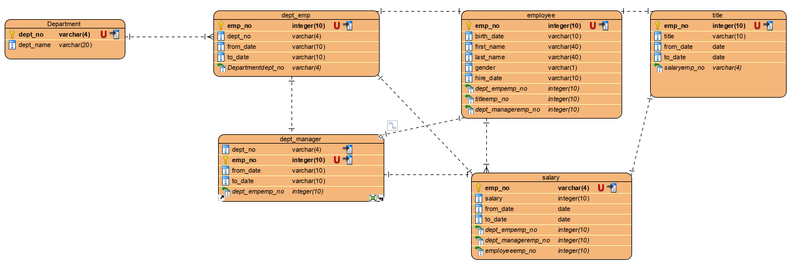

# HW9_SQL - Employee Database

Solve howework for SQL 

## Data modeling
I used visual paradigm to model the database. 

## ## Data Engineering

* Queries are saved in "code/queries.sql"
* Tables are saved in x.csv files in "result_csv/"

## Data Analysis

* Scripts to solve exercises are saved in "code/table_schemata.sql"

## Bonus (Optional)

To solve the bonus, database setting are saved in "code/database.ini". 

"database.ini" contains:
- [postgresql]
- host=localhost
- database=database_name
- user=user_name
- password=database_password

"database.ini" is read in config() in the python code ("Test_bar.ipynb")
